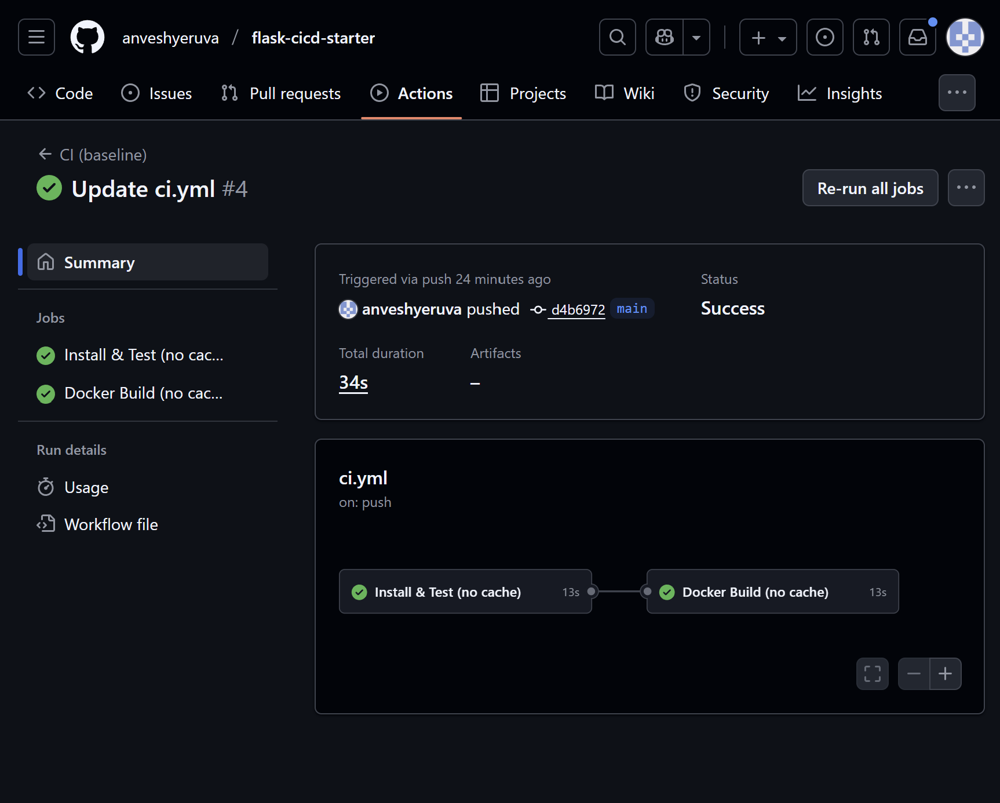
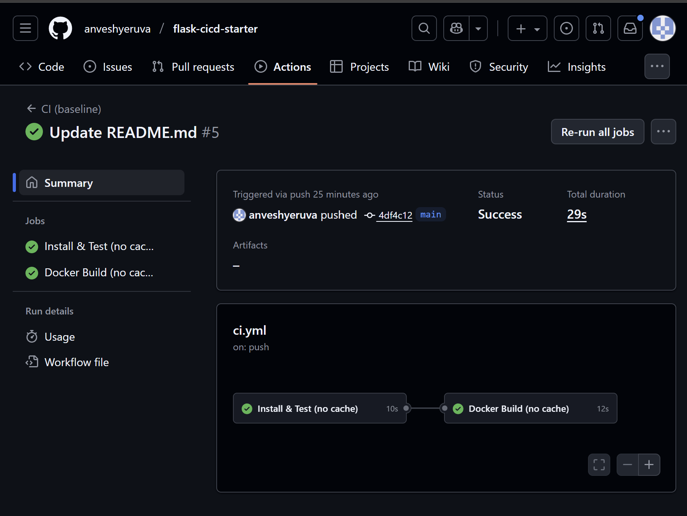
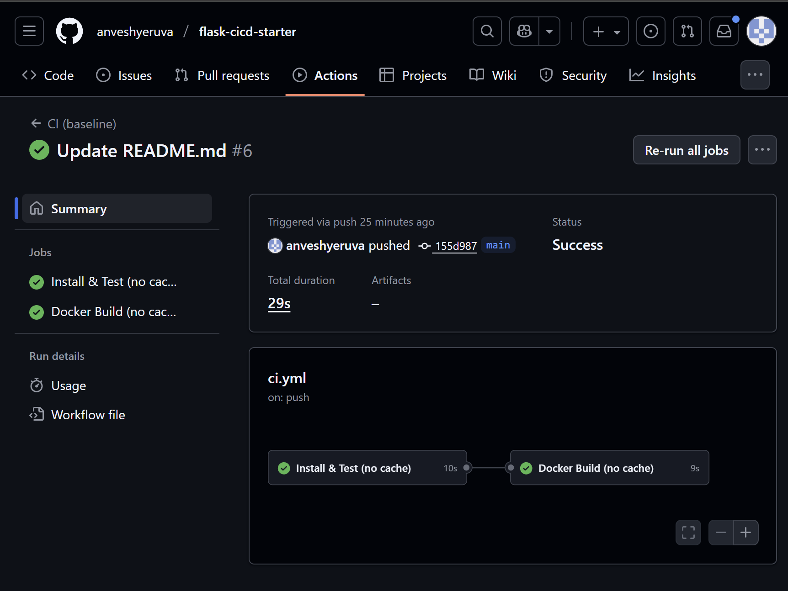
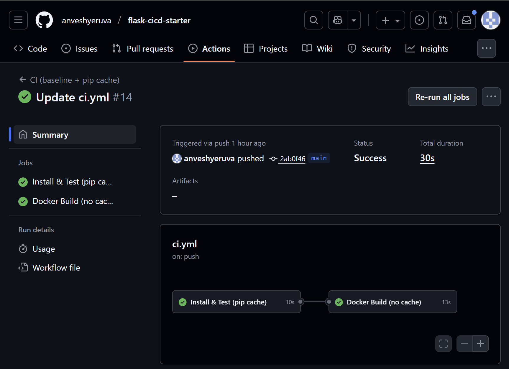
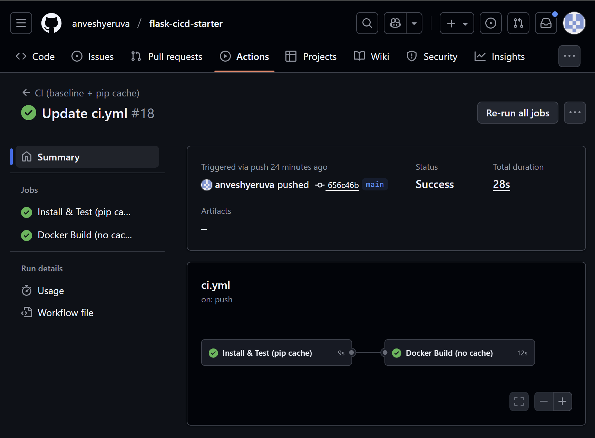
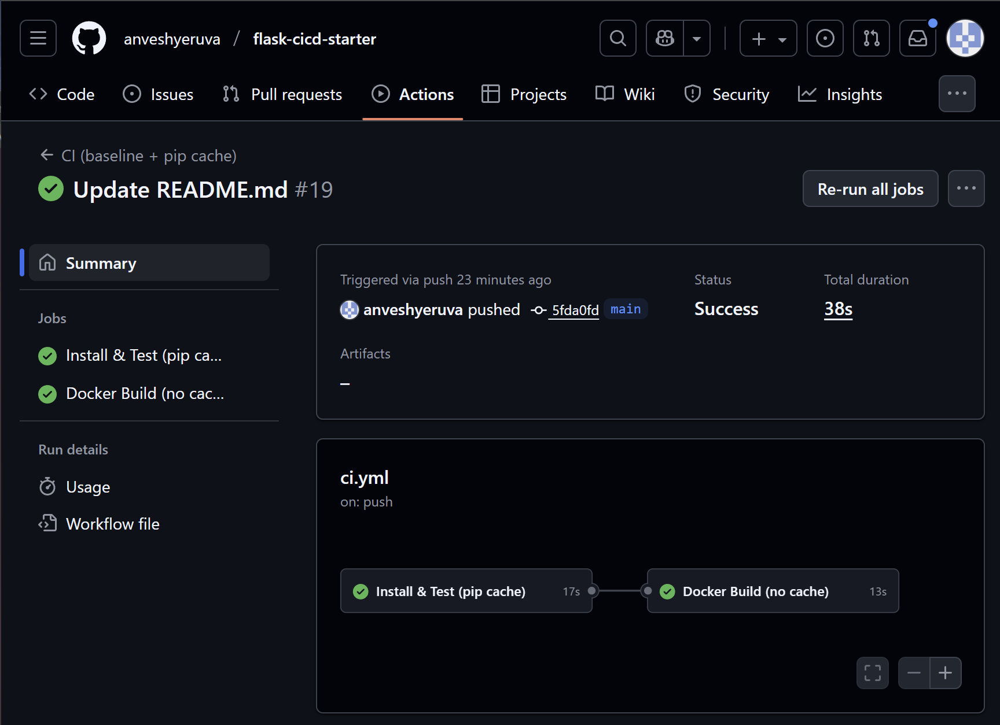

# Baseline Timings

| Run | Install & Test | Docker Build | Total |
|-----|----------------|--------------|-------|
| 1   | 13s            | 13s          | 34s   |
| 2   | 10s            | 12s          | 29s   |
| 3   | 10s            | 9s           | 29s   |
| 4   | 8s             | 14s          | 33s   |
| **Avg** | 10.25s     | 12s          | 31.25s|

## Proof Screenshots
- Run 1: 
- Run 2: 
- Run 3: 
- Run 4: 

## Optimized – Pip cache

### Summary Table

## Optimized – Pip Cache

| Run | Install & Test | Docker Build | Workflow Total |
|-----|----------------|--------------|----------------|
| 17  | 13s            | 13s          | 34s            |
| 18  | 9s             | 12s          | 28s            |
| 19  | 17s            | 13s          | 38s            |
| 20  | 11s            | 12s          | 34s            |
| **Avg** | 12.5s      | 12.5s        | 33.5s          |

### Proof Screenshots
- Run 1: 
- Run 2: 
- Run 3: 
- Run 4: 

