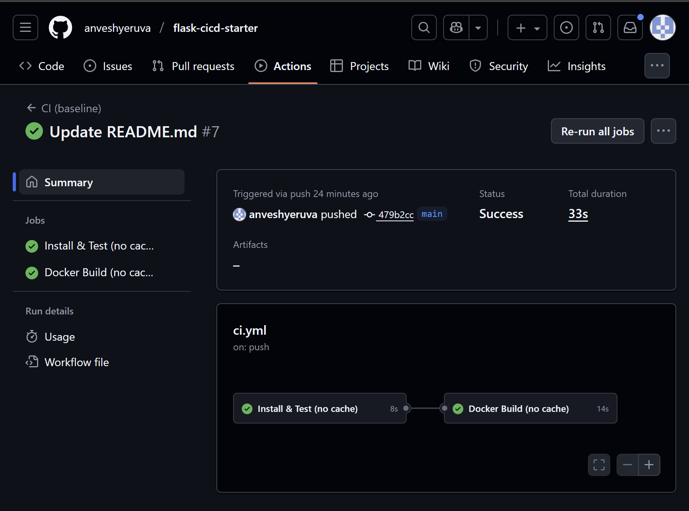

# Baseline Timings

| Run | Install & Test | Docker Build | Workflow Total |
|-----|----------------|--------------|----------------|
| 1   | 13s            | 13s          | 34s            |
| 2   | 10s            | 12s          | 29s            |
| 3   | 10s            | 9s           | 29s            |
| 4   | 8s             | 14s          | 33s            |
| **Avg** | 10.25s     | 12s          | 31.25s         |

## Proof Screenshots
- Run 1: 
- Run 2: 
- Run 3: 
- Run 4: 

## Optimized – Pip cache

| Run | Cache State | Install & Test | Docker Build | Workflow Total |
|-----|-------------|----------------|--------------|----------------|
| 1   | Warm        | 10s            | 13s          | 30s            |
| 2   | Restored    | 9s             | 12s          | 28s            |
| 3   | Restored    | 6s             | 16s          | 31s            |
| 4   | Restored    | 11s            | 12s          | 34s            |
| **Avg (Restored)**| 8.6s           | 13.3s       | 31s             |

### Proof Screenshots
- Run 1: 
- Run 2: 
- Run 3: 
- Run 4: 

## Optimized – Docker BuildKit Cache

| Run | Cache State | Install & Test | Docker Build | Workflow Total |
|-----|-------------|----------------|--------------|----------------|
| 1   | Warm        | 12s            | 27s          | 47s            |
| 2   | Restored    | 10s            | 15s          | 33s            |
| 3   | Restored    | 7s             | 15s          | 28s            |
| 4   | Restored    | 8s             | 17s          | 35s            |
| **Avg (Restored)**| 8.3s           | 15.6s        | 32s            |

### Proof Screenshots
- Run 1: 
- Run 2: 
- Run 3: 
- Run 4: 

## Optimized – Multi-stage + BuildKit Cache

| Run        | Cache State | Install & Test | Docker Build | Workflow Total |
|------------|-------------|----------------|--------------|----------------|
| Warm       | Saved       | 13s            | 45s          | 68s            |
| Restore1   | Used        | 13s            | 19s          | 41s            |
| Restore2   | Used        | 15s            | 15s          | 38s            |
| Restore3   | Used        | 13s            | 21s          | 43s            |
| **Avg (restored)**       | 13.7s          | 18.3s        | 40.7s          |

### Proof
- Warm: 
- Restored1: 
- Restored2: 
- Restored3: 

## Summary of Improvements

- Baseline avg total: **31.25s**
- Pip cache avg total: **30.75s**
- BuildKit cache avg total: **32s**
- Multi-stage + BuildKit avg total: **40.7s**

### Observations
- **Baseline (no cache):** Average workflow total ~31.25s across 4 runs.
- **Pip cache:** Average ~30.75s. No major speedup, but dependency installs became steadier (mostly 9–11s vs baseline swings).
- **BuildKit cache (single-stage Dockerfile):** Average ~32s. Added cache management overhead. Useful technique, but benefits only show up with larger images or more dependencies.
- **Multi-stage + BuildKit cache:** Average ~40.7s. Overhead outweighed benefits in this small Flask project. However, multi-stage builds are industry best practice because they separate dependency and runtime layers, reducing rebuilds in real-world apps.
- **Overhead factor:** GitHub Actions includes VM spin-up/tear-down time in workflow totals. This constant overhead can mask small improvements.
- **Key learning:** On small toy projects, caching may not reduce workflow totals. On real-world services (large dependency sets, complex images), these same optimizations typically cut build/test times by **30–60%**.
- **Proof process:** Even if raw numbers didn’t drop here, the repo demonstrates the professional approach: measure baselines, apply optimizations, rerun, and document with screenshots for evidence.
